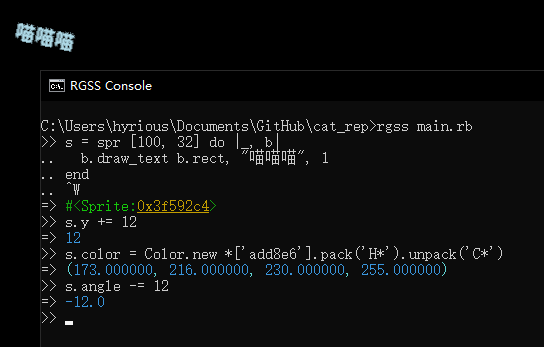

## CAn'T REProduce



This is my [RGSS3][1] (including [RGD][2]) playground.

### Get Started

Since I do not want to put any binary file in a git repo, you have to
put Game.exe, RGSS301.dll and [RGD.exe][3] (rename the DX9 _Game.exe_ to
_RGD.exe_, optional) in the root folder. [Find them here](Prerequisites.md).

### Start the REPL

This will use a dumb file-based server-client logic to communicate between the game process and the console.

```cmd
:: Make rgss.exe if you do not have one.
make
:: Run console.rb
rgss console.rb
```

### Start the Game

```cmd
:: Put your game logic in main.rb
edit main.rb
:: Run run_main.rb
rgss run_main.rb
```

Hint: add `` $: << 'lib' `` at the top to enable `require "file"` from the lib folder.

### Build

There are several build tools on Windows, these are recommended:

- [TDM-GCC][4] for tiny experiments
- [MSYS2][5] for GCC toolchain build
- [Clang][6] for newer and more strict language mode
- [vcpkg][7] for libraries, prebuilt binaries
- [Visual Studio][11] if you are a fan of Microsoft

### License

This project is licensed under [GLWTPL][8].

If any script from this project helps you and you want to share/redistribute it,
you can follow the [GLWTPL][8] or [the MIT License][9] ([RBLv1][10] if you are
in China).

[1]: https://forums.rpgmakerweb.com/index.php?forums/rgss3-scripts-rmvx-ace.35/
[2]: https://cirno.mist.so/archives/290
[3]: https://cirno.mist.so/archives/290#instructions
[4]: http://tdm-gcc.tdragon.net/download
[5]: https://www.msys2.org/
[6]: http://releases.llvm.org/download.html
[7]: https://github.com/microsoft/vcpkg
[8]: https://github.com/me-shaon/GLWTPL/blob/master/LICENSE
[9]: https://opensource.org/licenses/MIT
[10]: https://github.com/hyrious/RBLv1
[11]: https://visualstudio.microsoft.com
